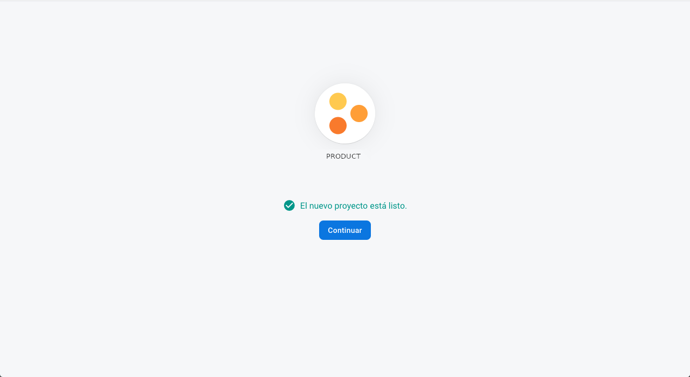
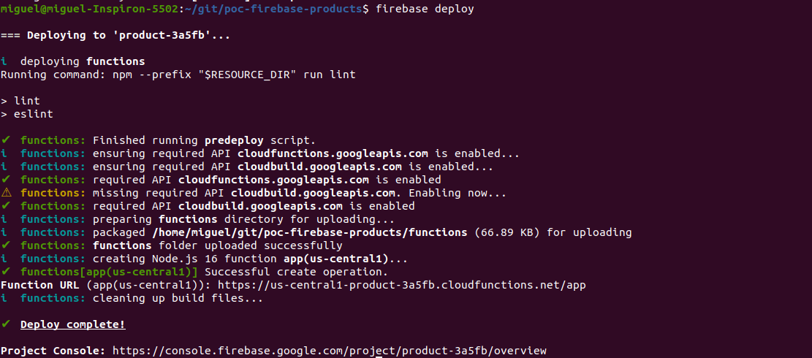
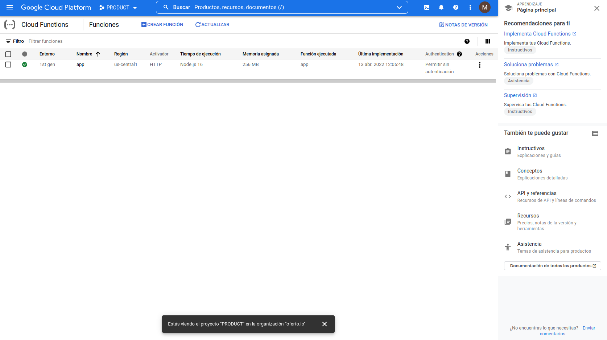

## Description
PoC Firebase TypeScript Product Function

## Deploy Firebase Project

Create a Firebase project from [Firebase Console](https://console.firebase.google.com/)


STEP 01:


STEP 02:

Select if we want active Google Analytics.


STEP 03:



## Configure Firebase Project

Now we create a Firestore Database a NoSQL database from Firebase Console


Firestore from firebase console


Firestore from Google Clooud Platform


## Login

We must to login in Google Cloud Platform at first

```sh
firebase login
```

## Initialize firebase functions project

```sh
firebase init functions
```

## Debug local service

We could debug our local service before deploy in Google Cloud Platform

```sh
firebase serve
```

## Deploy service on Google Cloud Platform

If we obtaine errors from eslint remove the dot point from package lint scripts
```sh
firebase deploy
```



Obtaine the firebase uri

```sh
https://us-central1-product-3a5fb.cloudfunctions.net/app
```

Firebase from Google Functions on Google Cloud Platform


## Debug Typescript functions

**STEP 01**: Install dependency **copyfiles** to copy non ts files to lib compiled destination folder:

```sh
npm install --save.dev copyfiles
```

**STEP02**: Configure typescript tsconfig.json file to watch changes when debug:

```sh
{
    ...
    "watch": true
}
```

**STEP 03**: Compile from functions folder. The build process keep wait in watch mode.

```sh
npm build
```

**STEP 04**: From root folder debug your firebase functions executing:

```sh
firebase serve
```

